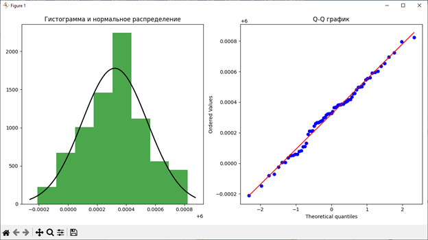
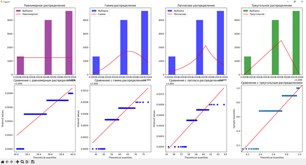

# Lab Work: Statistical Sample Analysis According to GOST 8.736-2011

## Description
This work was completed as part of the "Metrology" course in the Bachelor's program at HSE University. The project implements statistical sample analysis in accordance with GOST 8.736-2011 using Python. The work includes:

- Calculation of mean, standard deviation, and standard error of the mean.
- Detection of gross errors using the Grubbs test.
- Testing the normality of the sample distribution (χ² test, Kolmogorov–Smirnov test).
- Calculation of confidence intervals for measurements.
- Assessment of skewness, kurtosis, and counter-kurtosis.
- Calculation of overall mean and overall standard deviation according to GOST.
- Visualization of data and statistical characteristics.

## Libraries Used
- `pandas` — for working with tables and data.
- `numpy` — for numerical calculations.
- `scipy` — for statistical tests and distribution functions.
- `tabulate` — for console table output.
- `matplotlib` and `seaborn` — for plotting and data visualization.

## Installation
1. Install Python version 3.10 or higher.
2. Install required libraries:
```bash
pip install pandas numpy scipy tabulate matplotlib seaborn
```

## Data Preparation
Data should be in a `.txt` file with a single column of numerical measurements. Example:
```
12.3
13.5
11.8
12.1
...
```

## Running the Analysis
Example command to run the analysis for `data.txt`:
```bash
python analysis.py --input data.txt
```

The script will output:
- Mean and standard deviation of the sample.
- Detection of outliers (Grubbs test).
- Normality tests.
- Confidence intervals and statistical characteristics (skewness, kurtosis).
- Distribution plots.

## Theoretical Background
- **Sample mean:**
```math
\bar{x} = \frac{1}{n} \sum_{i=1}^{n} x_i
```

- **Sample standard deviation:**
```math
s = \sqrt{\frac{1}{n-1} \sum_{i=1}^{n} (x_i - \bar{x})^2}
```

- **Standard error of the mean:**
```math
\sigma_{\bar{x}} = \frac{s}{\sqrt{n}}
```

- **Grubbs test:** Detection of gross errors.
- **Normality tests:** χ² and Kolmogorov–Smirnov tests.
- **Confidence intervals:** Calculated according to GOST 8.736-2011.

## Results
- Tables of sample characteristics.
- Plots of distributions and confidence intervals.

### Examples

*Figure 1: Histogram and Q-Q plot comparison of the sample distribution with the normal distribution.*

### Example 2

*Figure 2: Histogram and quantile comparison of the sample distribution with other distributions.*
